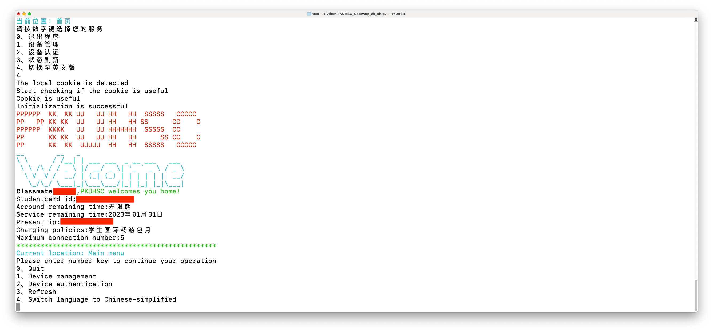

# PKUHSC_Gateway  
北大医学部校园网网关
## 前言  
今年（2022）是北大医学办学110周年，作者写此校园网认证脚本献礼（也没啥好拿出手的，想想自己上学期学了点爬虫，就写了这个脚本）
## 功能介绍  
### 已实现官方web端已有功能  
1. 设备管理
	- 下线设备（包含单个下线和下线全部）
	- 解绑设备（官方只有一次解绑一个）
	- 设备重命名
2. 设备认证
	- 本机未来免密认证
	- 本机未来需密认证
### 已实现官方web端未有功能  
1. 设备管理
	- 一键解绑全部设备
2. 设备认证
	- 非本机未来免密认证（基于ip地址）
	- 非本机未来需密认证（基于ip地址）
	- 批量认证（基于ip地址）
3. 语言
	- 中英双语

## 食用指南  
1. 首先把需要的包都装好
在终端输入```pip install requests,time,re,os,execjs,datetime```
2. 将main文件夹下载到本地，编辑```PKUHSC_Gateway_en_us.py```和```PKUHSC_Gateway_zh_ch.py```文件，在配置区填入账号和密码，然后选择文件运行（前者默认中文，后者默认英文，也可运行后切换语言）
在终端输入```python 对应文件路径```  
后面的都是傻瓜式操作。
## 功能展示  


